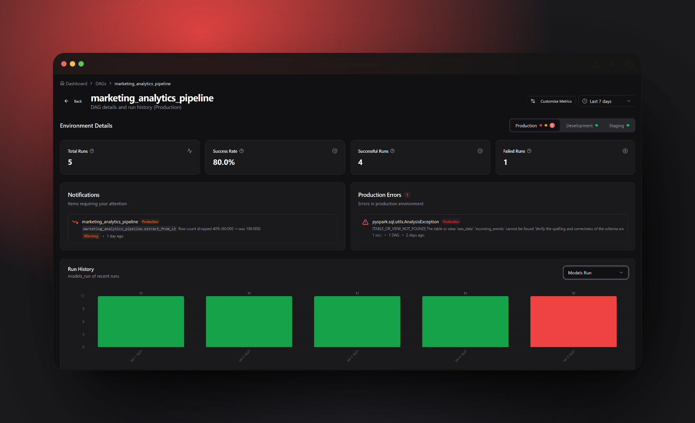

<p align="center">
  
</p>

<p align="center">
  
  
  
  
</p>

<h1 align="center">🔍 Granyt</h1>

<p align="center">
  <strong>A modern, open source all-in-one monitoring platform for Apache Airflow that lets you catch errors and data issues before they reach production.</strong>
</p>

<p align="center">
  <a href="#-features">Features</a> •
  <a href="#-quick-start">Quick Start</a> •
  <a href="#-project-structure">Project Structure</a> •
  <a href="#-documentation">Documentation</a> •
  <a href="#-contributing">Contributing</a>
</p>

---



---

## ✨ Features

- **📊 DAG Monitoring** - Real-time visibility into your data pipelines with run history, duration trends, and success rates
- **🚨 Smart Alerts** - Configurable alerts for failures and data anomalies with email, Slack, and webhook notifications
- **🐛 Error Tracking** - Centralized error aggregation with fingerprinting and stack trace analysis
- **🔗 Lineage Tracking** - Automatic data lineage capture via OpenLineage integration
- **📈 Metrics Collection** - Automatic capture of metrics from popular operators (Snowflake, BigQuery, dbt, S3, and more)
- **🌐 Multi-Environment** - Unified monitoring across dev, staging and production environments
- **🔓 Open Source & Self-Hostable** - Complete control over your data with flexible, self-hosted deployment
---

## 🚀 Quick Start

### 1. Deploy the Granyt App

```bash
# Download the docker-compose file
curl -O https://raw.githubusercontent.com/jhkessler/getgranyt/main/granyt-app/docker-compose.yml

# Create a .env file with required variables
cat > .env << EOF
POSTGRES_PASSWORD=$(openssl rand -hex 24)
BETTER_AUTH_SECRET=$(openssl rand -hex 32)
BETTER_AUTH_URL=http://localhost:3000
EOF

# Start with Docker Compose
docker compose up -d
```

Open [http://localhost:3000](http://localhost:3000) and create your account.

> For production deployment with SMTP, reverse proxy setup, and more options, see the [Deployment Guide](./granyt-app/DEPLOYMENT.md).

### 2. Install the SDK in Airflow

The Granyt SDK is a Python listener that must be installed where your Airflow workers and scheduler run. It automatically captures DAG and task execution events and sends them to your Granyt dashboard.

Install the SDK in your Airflow environment's Python (e.g., add to your `requirements.txt` or install directly in your Airflow container/virtualenv):

```bash
pip install granyt-sdk
```

### 3. Configure the SDK

Set environment variables in your Airflow environment:

```bash
export GRANYT_ENDPOINT="https://granyt.yourdomain.com"
export GRANYT_API_KEY="your-api-key"  # Get this from the Granyt dashboard
```

That's it! The SDK automatically captures lineage and errors from your DAGs.

---

### Operator Adapters

The SDK includes built-in adapters for popular Airflow operators that automatically extract rich metrics:

| Category | Operators | Key Metrics |
|----------|-----------|-------------|
| **Snowflake** | `SnowflakeOperator`, `SnowflakeSqlApiOperator`, `S3ToSnowflakeOperator` | `row_count`, `query_id`, `warehouse`, `database`, `schema` |
| **BigQuery** | `BigQueryInsertJobOperator`, `BigQueryCheckOperator`, `GCSToBigQueryOperator` | `bytes_processed`, `row_count`, `query_id`, `slot_milliseconds` |
| **Generic SQL** | `SQLExecuteQueryOperator`, `SQLColumnCheckOperator`, `BranchSQLOperator` | `row_count`, `database`, `schema`, `table` |
| **AWS S3** | `S3CopyObjectOperator`, `S3ListOperator`, `S3DeleteObjectsOperator` | `files_processed`, `bytes_processed`, `source_path`, `destination_path` |
| **GCS** | `GCSCreateBucketOperator`, `GCSListObjectsOperator`, `GCSSynchronizeBucketsOperator` | `files_processed`, `bytes_processed`, `source_path`, `destination_path` |
| **dbt** | `DbtCloudRunJobOperator`, `DbtRunOperator`, `DbtTestOperator` | `models_run`, `tests_passed`, `tests_failed`, `row_count` |

For more details on how we extract metrics from specific operators, see the [Operator Adapters documentation](https://granyt.dev/docs/operators).

---

### Rich Error Capture

When a task fails, the SDK automatically captures:

- Full stack trace with local variables
- Task instance metadata (dag_id, task_id, run_id, try_number, etc.)
- System information (Python version, Airflow version, hostname, etc.)
- DAG configuration and task parameters
- Environment context
- Previous log entries

---

## 🚀 Usage

Once installed and configured, the SDK works automatically. No code changes are required in your DAGs.

### Reporting Custom Metrics from Python Tasks

The most flexible way to report custom metrics from an Airflow `@task` or `PythonOperator` is to include a `granyt` key in your return value. The SDK automatically captures everything inside this dictionary from the xcom.

#### Simple Manual Metrics
You can pass any key-value pairs you want to track in your dashboard:

```python
@task
def process_data():
    # ... your logic ...
    return {
        "granyt": {
            "row_count": 1500,
            "data_quality_passed": True,
            "source_file": "users.csv"
        }
    }
```

#### Automatic Metric Calculation
For deep data insights, use `compute_df_metrics`. It automatically calculates row counts, null counts, and column types from your Pandas or Polars DataFrames. Pass the result to `granyt["df_metrics"]` to get schema change detection and rich metrics:

```python
from granyt_sdk import compute_df_metrics

@task
def transform_data():
    df = pd.read_parquet("data.parquet")
    
    return {
        "granyt": {
            # automatically captures schema and df metadata
            "df_metrics": compute_df_metrics(df),
            "data_quality_passed": True
        }
    }
```

#### Custom DataFrame Support

You can add support for other DataFrame types by creating a custom adapter:

```python
from granyt_sdk import DataFrameAdapter, register_adapter

class SparkAdapter(DataFrameAdapter):
    @classmethod
    def can_handle(cls, df):
        return hasattr(df, 'rdd')
    
    @classmethod
    def get_type_name(cls):
        return "spark"
    
    @classmethod
    def get_columns_with_dtypes(cls, df):
        return [(f.name, str(f.dataType)) for f in df.schema.fields]
    
    @classmethod
    def get_row_count(cls, df):
        return df.count()

register_adapter(SparkAdapter)
```

---
## 📁 Project Structure

This monorepo contains two main components:

| Component | Description | Documentation |
|-----------|-------------|---------------|
| **[granyt-app](./granyt-app)** | Next.js web dashboard for monitoring and configuration | [README](./granyt-app/README.md) |
| **[granyt-sdk](./granyt-sdk)** | Python SDK for Apache Airflow integration | [README](./granyt-sdk/README.md) |

### How They Work Together

```
┌─────────────────────────────────────────────────────────────────┐
│                     Apache Airflow                               │
│  ┌─────────────┐  ┌─────────────┐  ┌─────────────┐              │
│  │   DAG 1     │  │   DAG 2     │  │   DAG 3     │              │
│  └─────────────┘  └─────────────┘  └─────────────┘              │
│         │               │               │                        │
│         └───────────────┼───────────────┘                        │
│                         │                                        │
│              ┌──────────▼──────────┐                             │
│              │    granyt-sdk       │  ← Automatic capture        │
│              │  (Python package)   │                             │
│              └──────────┬──────────┘                             │
└─────────────────────────┼───────────────────────────────────────┘
                          │ REST API
                          ▼
              ┌───────────────────────┐
              │     granyt-app        │  ← Web dashboard
              │   (Next.js + DB)      │
              └───────────────────────┘
```

---

## 📚 Documentation

| Resource | Description |
|----------|-------------|
| [granyt-app README](./granyt-app/README.md) | Web app setup, tech stack, and development |
| [granyt-sdk README](./granyt-sdk/README.md) | SDK installation, configuration, and usage |
| [Deployment Guide](./granyt-app/DEPLOYMENT.md) | Production deployment options |
| [Contributing Guide](./granyt-app/CONTRIBUTING.md) | How to contribute to Granyt |
| [Security Policy](./granyt-app/SECURITY.md) | Security practices and reporting |
| [Operator Adapters](./granyt-sdk/https://granyt.dev/docs/operators) | Supported Airflow operators |

---

## 🤝 Contributing

We welcome contributions! Please see our [Contributing Guide](./granyt-app/CONTRIBUTING.md) for details.

1. Fork the repository
2. Create a feature branch (`git checkout -b feature/amazing-feature`)
3. Commit your changes (`git commit -m 'feat: add amazing feature'`)
4. Push to the branch (`git push origin feature/amazing-feature`)
5. Open a Pull Request

---

## � Contact

- **GitHub:** [@jhkessler](https://github.com/jhkessler)
- **Email:** johnny@granyt.dev
- **Issues:** [GitHub Issues](https://github.com/jhkessler/getgranyt/issues)

---

## �📄 License

This project is licensed under the MIT License - see the [LICENSE](LICENSE) file for details.

---

<p align="center">
  <strong>Built with ❤️ for the data engineering community</strong>
</p>
